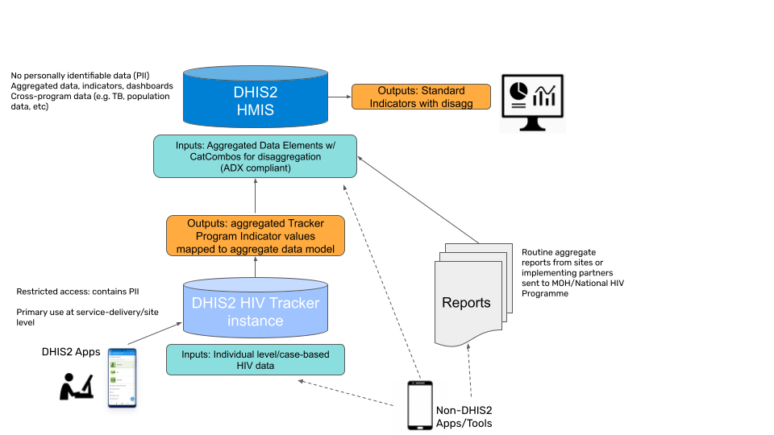
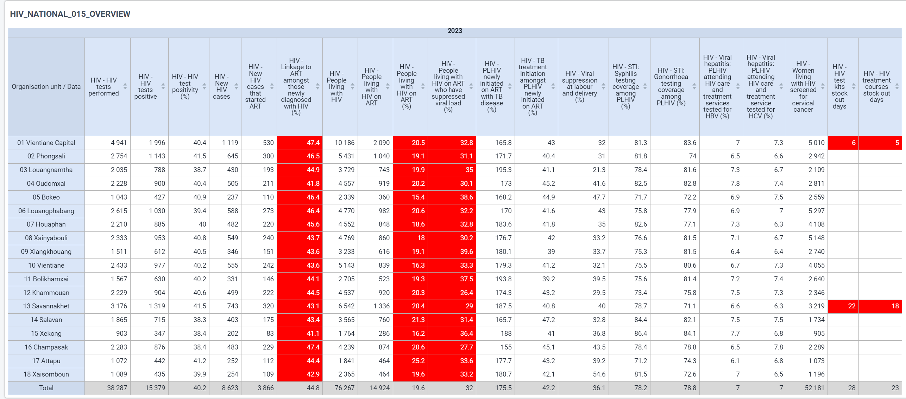
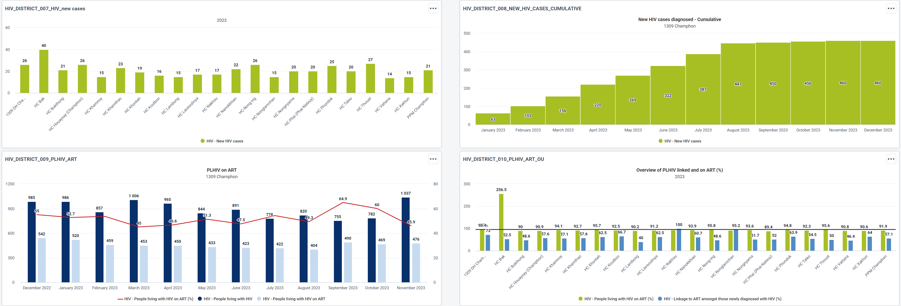
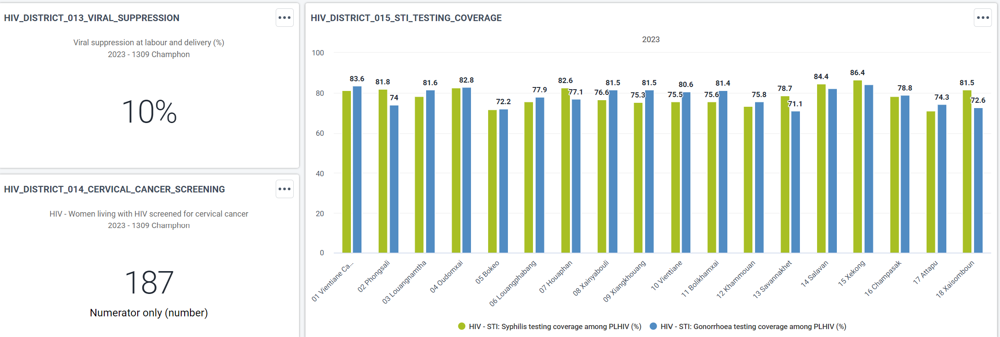
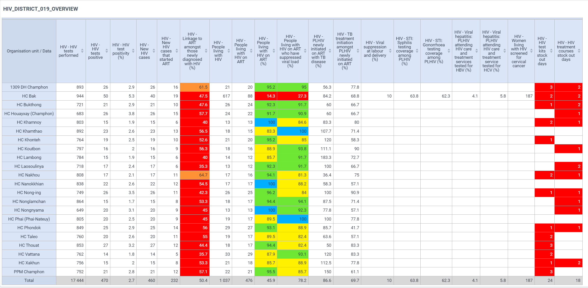

# HIV HMIS System Design { #hiv-agg-design }

Version 2.0.0

## Introduction

This document describes the conceptual system design in DHIS2 for integrating routine HIV programme and case data into a national HMIS for analysis and use. The system design and metadata support all core and optional indicators from routine data sources in the WHO's [Consolidated guidelines on person-centred HIV strategic information: strengthening routine data for impact (2022)](https://www.who.int/publications/i/item/9789240055315), including HIV case surveillance, testing & treatment indicators (n=57) and HIV prevention indicators (n=43).

Dashboards are designed to support national, district and facility levels to conduct routine analysis on a core set of indicators as described in the [WHO Analysis and Use of Health Facility Data Guidance for HIV Programme Managers](https://cdn.who.int/media/docs/default-source/documents/ddi/facilityanalysisguide-hiv.pdf) (2019).

### Acknowledgements

HISP Centre is grateful to the WHO Global HIV Programme and Division of Data, Analytics, and Delivery for Impact (DDI) for their ongoing partnership through a Collaborating Centre agreement. Subject matter expertise from the HIV programme and other focal points was crucial for the development and optimization of this product. We are also grateful to the Global Fund for their financial support to develop the HIV product suite for DHIS2. 

## System Structure

### Architecture

The HMIS module for HIV is designed to support typical national health information system architecture in countries. The architecture recognizes that DHIS2 may not be the primary source for all HIV-related data, but plays a significant role in bringing data together for routine analysis and triangulation with other sources. 

Following this illustrative architecture, the HMIS -- leveraging the robust aggregate data model that is optimized for analysis -- serves as a central repository for routine and other data sources. Individual level data systems for person-centered monitoring are maintained separately from the HMIS for privacy, confidentiality, and optimized performance. These individual level data systems may use DHIS2 Tracker for person-centered monitoring of at-risk populations enrolled in prevention programs, as well as life-long monitoring of individual HIV cases to produce accurate, timely data on strategic information indicators such as linkage of individuals at substanital risk to prevention services, PLHIV currently on treatment, viral load testing coverage, and initiation of TB preventive treatment among PLHIV. 

For more information on designing and using DHIS2 for person-centered monitoring, please see the guides on HIV Prevention and HIV Case Surveillance. 

### Data Sets

The following datasets describe the frequency and type of data to be integrated into the HMIS for routine programme monitoring & analysis. Note that while datasets can be used for aggregate paper-based reporting among facilities and sites that have not yet digitized individual-level reporting, these datasets **also** serve as a central repository for bringing anonymized, aggregated data from DHIS2 Tracker, EMRs, and other sources. These datasets and their corresponding data elements provide the analytical dimensions needed for generating indicators and performant dashboards at national scale and for sub-national use. 

| Name | Periodicity | Purpose |
| --- | --- | --- |
| HIV surveillance (monthly) | Monthly | HIV case data required for routine monthly analysis. This data set can receive Tracker data from a case-based system or can be used for aggregated paper-based reporting from prevention sites (with adaptation/simplification of disaggregation). |
| HIV surveillance (yearly) | Annual | HIV case data required for annual analysis of data reported from Tracker or other case-based surveillance systems. A separate annual dataset is provided to avoid double-counting that can occur when aggregating monthly reported data. |
| HIV prevention (monthly) | Monthly | HIV prevention data required for routine monthly analysis. This data set can receive Tracker data from an individual level system or can be used for aggregated paper-based reporting from prevention sites (with adaptation/simplification of disaggregation). |
| HIV prevention (annual) | Annual | HIV prevention data required for annual analysis of data reported from Tracker or other case-based surveillance systems. A separate annual dataset is provided to avoid double-counting that can occur when aggregating monthly reported data. |
| HIV stock report | Monthly | Facility stock data for essential commodities that can be reported directly from facilities (stock-on-hand, stock distributed, stock received, etc). |
| HIV Health Facility Profile | Annual | Dataset for incorporating data from the Health Facility Profile on availability of HIV testing services and ART treatment. |
| HIV surveillance population estimates | Annual | Dataset for recording estimates of PLHIV (such as Spectrum estimates), uninfected HIV population and HIV-positive women who delivered babies for use in denominators for key HIV indicators. |
| HIV prevention population estimates | Annual | Dataset for recording estimates of people eligible for PrEP, opioid dependents, people who inject drugs and uninfected population for use in denominators of key HIV indicators. |

## HIV Programme Dashboards 

Two overarching programmatic monitoring dashboards are available and optimized for users at the national programme and district levels. These dashboards use indicators and data visualizations from across programmatic interventions, including the 95-95-95 cascade to monitor the number of people living with HIV who know their HIV status, are on treatment, and virally suppressed; incidence and mortality, new case diagnoses, availability of HIV testing services and essential HIV commodities at facilities and treatment sites; and comorbidities with TB, STIs, and other related diseases. These dashboards include aggregated data from person-centered monitoring using DHIS2 Tracker for prevention and case surveillance; but also include programmatic data from other key sources for holistic programme management. 

The dashboards and underlying indicators included in the HMIS module are designed in a way that prioritizes **bringing data together in DHIS2 as an integrated platform for analysis** from across paper-based and digital sources -- regardless of whether DHIS2 Tracker, EMRs or other digital tools are used at the lowest levels. It also brings in semi-routine data such as Health Facility Profile data on availability and readiness for service delivery, as well as non-routine data like Spectrum estimates and population denominators to allow for meaningful analyses. 

### HIV HMIS - National Dashboard

The national HIV dashboard provides national programmes and other stakeholders with timely key metrics for monitoring the HIV epidemic in their country as well as progress of key HIV interventions. It is optimized to assist in strategy and policy decisions, intervention planning, resource allocation and monitoring key performance indicators. 

### HIV HMIS - District Dashboard 

The district HIV dashboard provides sub-national programme managers and district health officers with tailored data visualizations to monitor HIV programme performance and take sub-national actions. Many data visualizations are designed to enable sub-national users to compare metrics across health facilities to target supportive supervision, adjust resource allocation for testing/treatment services and optimize operations. The dashboards borrows from the same set of indicators as national dashboards, and sometimes includes more focus on numerators where coverage estimates are unlikely to be available at sub-national levels. 

**Facility availability of HIV testing services**

**Facility stock-outs of HIV tests & ARTs**

**New HIV diagnoses, linkage to treatment and PLHIV currently on treatment by facility**

**HIV-TB comorbidity and initiation of TB preventive treatment**

**Viral suppression at labor, PLHIV screened for cervical cancer and STI testing coverage among PLHIV**

**Facility key performance indicators**

## Validation Rules

The full list of validation rules is available in the Metadata reference file.

## References

1. [WHO Analysis and Use of Health Facility Data Guidance for HIV Programme Managers](https://cdn.who.int/media/docs/default-source/documents/ddi/facilityanalysisguide-hiv.pdf)  (March 2019)
2. WHO toolkit for analysis and use of health facility data, accessed at: [who.int/data/data-collection-tools/health-service-data/toolkit-for-routine-health-information-system-data/modules](https://www.who.int/data/data-collection-tools/health-service-data/toolkit-for-routine-health-information-system-data/modules)
3. WHO (2022). Consolidated Guidelines on person-centred HIV strategic information: strengthening routine data for impact (2022), accessed at: [who.int/publications/i/item/9789240055315](https://www.who.int/publications/i/item/9789240055315)
