# Case Surveillance Dashboards & Datasets { #hiv-cs-dashboards-datasets}

## Case Surveillance Dashboards

Thematic dashboards for monitoring various aspects of HIV care and treatment programming have been developed based on the core indicators included in WHO’s 2022 [*Consolidated guidelines on person-centred HIV strategic information*](https://www.who.int/publications/i/item/9789240055315). Standard dashboard visualizations developed with WHO’s guidance can be rendered at national or sub-national levels depending on user configuration.

Dashboards are served entirely by DHIS2 *indicators* as described in the next section. The following dashboards are available for routine analysis of HIV prevention activities.

### HIV CS - 01. Case surveillance

Volume of new HIV cases diagnosed during the current and previous year and the ones that have started ART

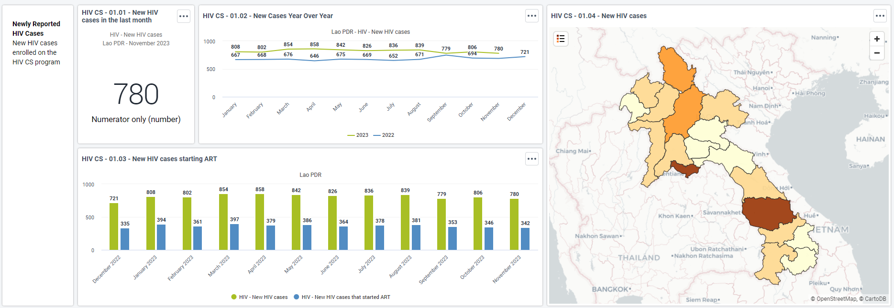

PLHIV in the current and at the end of the previous year disaggregated by age and gener

New HIV cases by probable route of transmission and PMTCT indicators

New HIV cases by Key Popualtion groups

### HIV CS - 02. ART initiation, retention and viral suppression

PLHIV on ART by months of the current year and geographical distribution

Linkage to ART at diagnosis, within 7 days and late ART initiation by period and organisation unit

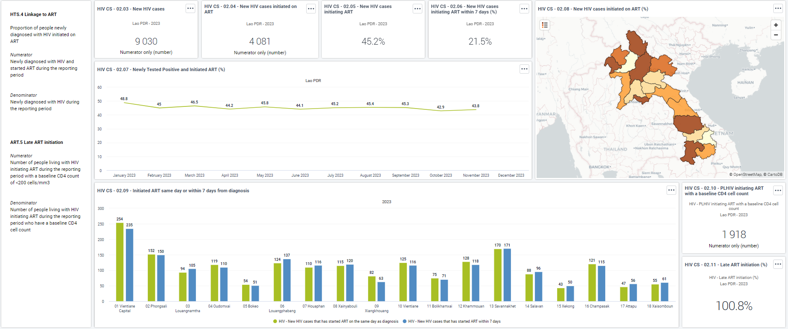

ART retention and treatment status up to today

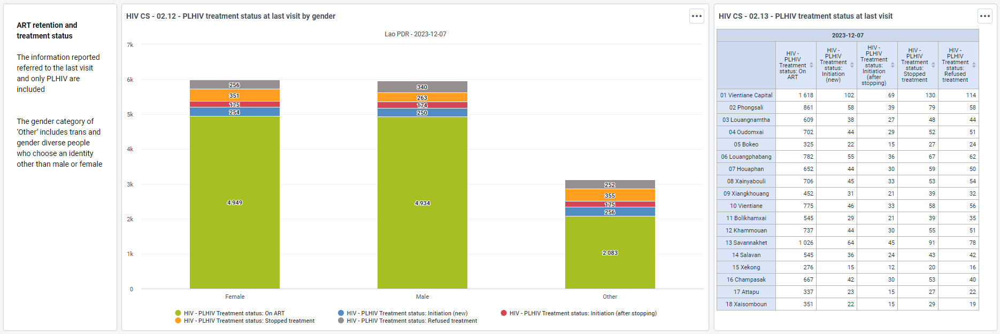

Total attrition from ART by months and organisation unit

AIDS-related deaths details by perido and organisation unit

Viral load testing coverage and PLHIV on ART with suppressed viral load

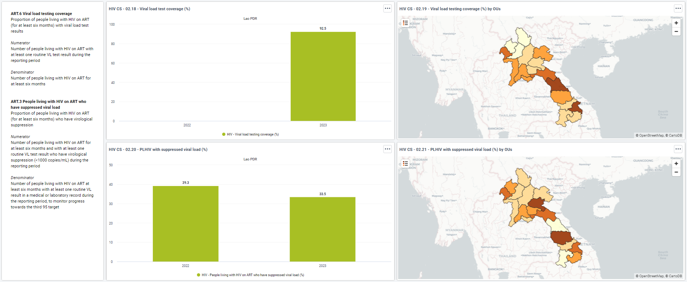

Early viral load testing by period and organisation units

### HIV CS - 03. DSD ART

Multi-monthly ART dispensing 

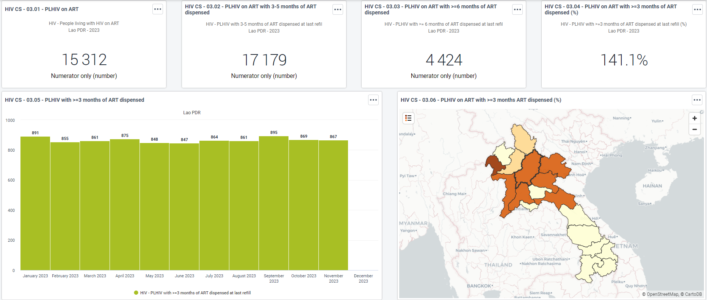

DSD ART models eligibility and enrollment 

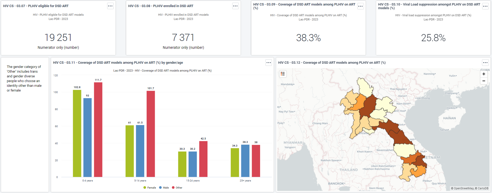

### HIV CS - 04. HIV/TB

TPT initiation and completion

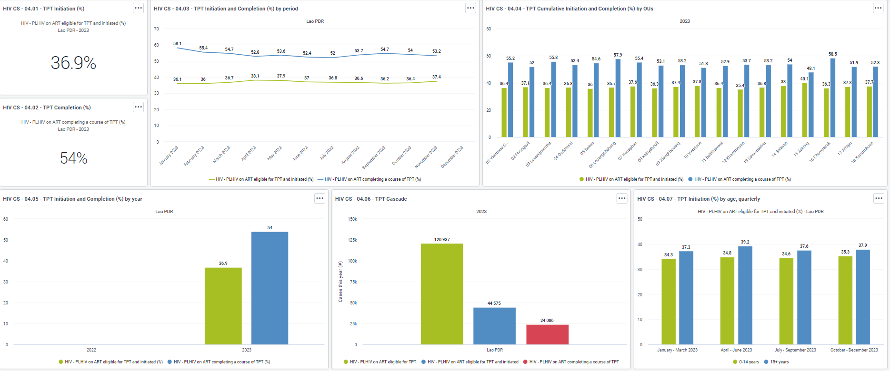

TB screening and diagnostic cascade considered priority for high burden HIV/TB settings

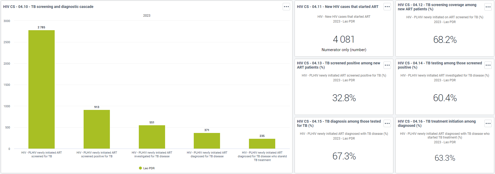

### HIV CS - 05. Epidemic Status

Visualisation for the three pilars (3 95%) and their performance during the time

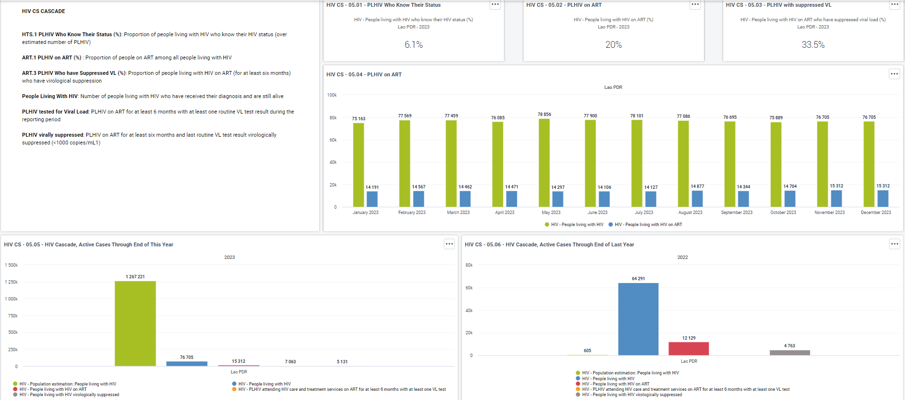

### HIV CS - 06. STI

Syphilis testing and treatment coverage over the time and organisation units

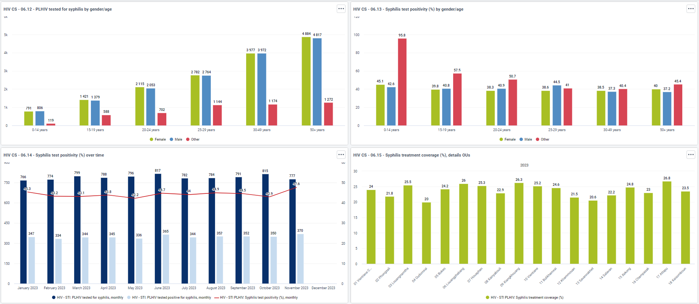

Gonorrhoea testing and treatment coverage over the time and organisation units

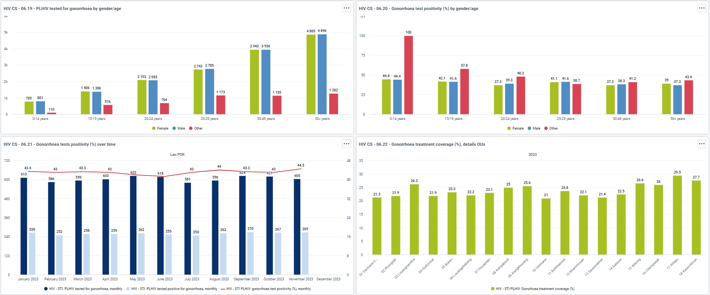

Presence of STI syndrome and repeat diagnosis of same STI syndrome within 12 months

### HIV CS - 07. Viral hepatitis

HBV test, positivity and treatment coverage by period and organisation units

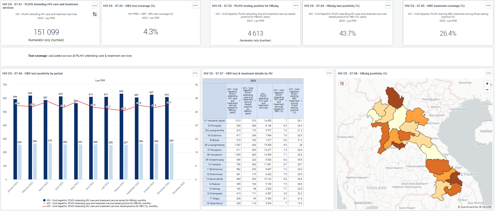

HCV test, positivity, treatment coveragea and cured by period and organisation units

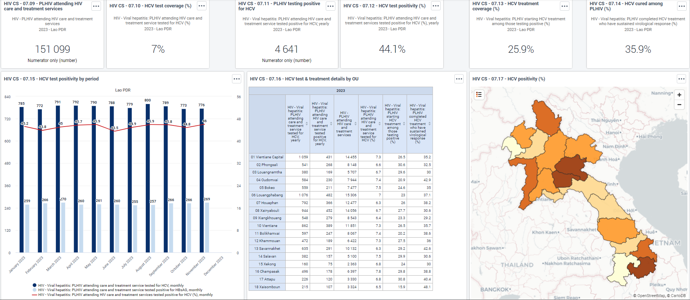

### HIV CS - 08. Cervical cancer

Cervical cancer screening coverage, outputs and treatment

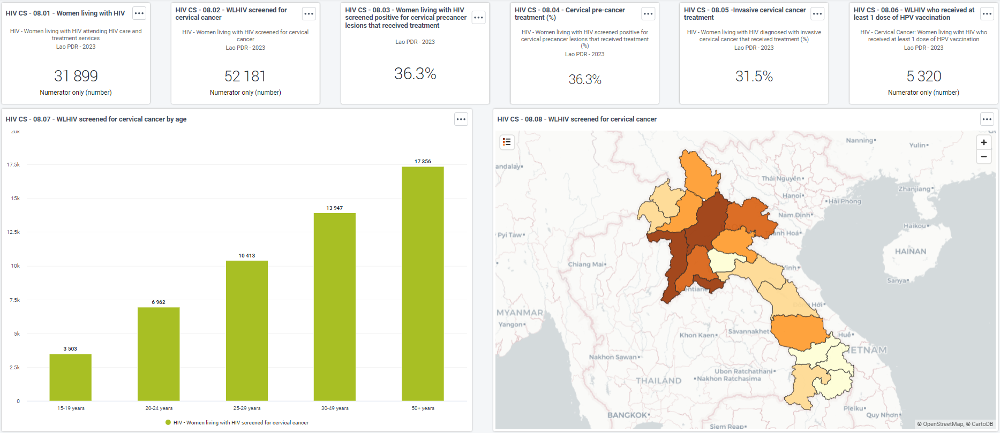

## Case surveillance indicators

The toolkit contains DHIS2 indicators which represent the core and optional indicators listed in the WHO’s 2022 [Consolidated guidelines on person-centred HIV strategic information](https://www.who.int/publications/i/item/9789240055315). 

All HIV Case Surveillance dashboards are served by DHIS2 indicators, which often combine numerators and denominators from individual-level data or other sources. The DHIS2 indicators are mapped and aligned to the indicator definitions and descriptions contained in the [WHO’s Digital Adaptation Kit (DAK) for HIV, second edition](resources/files/WHO_standard_indicators_cs.xlsx).

Two indicator groups have been configured to group the indicators as follows: 
- HIV Case Surveillance - WHO standard list (hQi48w5BAPp): contains all core WHO SI indicators.
- HIV Case Surveillance - Dashboard (UUipOH5GEN8): contains all indicators that are used in the standard recommended dashboards; these represent a subset of the WHO standard list

## Case Surveillance Data Sets

As described above, dashboards are populated using the aggregate data model, using DHIS2 indicators. Aggregate datasets, data elements and category combinations have been configured to serve the analytics based on the dimensions of analysis included in the strategic information and data use guidelines. When used in tandem with the DHIS2 Case Surveillance Tracker, values from program indicators are mapped to their corresponding aggregate data element and CatCombo in order to populate the numerators and denominators for all the indicators included above. These datasets can also be used for aggregated reporting among sites that do not yet have Tracker; or sites that submit routine reports that aggregate data from another individual level data collection tool. 

Detailed description of the configuration of program indicators for aggregating tracker data is described in the section Program Indicators. Mapping and exchange of Tracker data to Aggregate data model is described in the section Metadata Mapping & Data Exchange. 

There are three (3) distinct datasets for capturing HIV case surveillance data. These have been designed based on the analytical needs represented in the WHO’s analysis framework, whereby some metrics may be analyzed on a monthly basis while others are only reported and analyzed annually:

- HIV Case surveillance - Population estimates (annual)
- HIV case surveillance (yearly)
- HIV case surveillance (monthly)

### HIV Case surveillance - Population estimates

HIV Case surveillance - Population estimates
This dataset contains three (3) data elements which are not derived from routine reporting but are typically modeled estimates; and are typically made available by the HIV programme on an annual basis. These data elements are used for populating denominators for core indicators from the strategic information guidelines. The data set should be assigned to the lowest administrative level for which high-quality estimates exist and can be used for analysis. 

These estimates are used for the calculation of the following indicators: 

- HIV CS - ART.1 People living with HIV on ART (Population level) (%)
- HIV CS - VER.2  Early infant diagnosis (EID) coverage (2 months) (%)
- HIV CS - VER.2  Early infant diagnosis (EID) coverage (12months) (%)
- HIV CS - VER.3 Infant ARV prophylaxis coverage (Population level) (%)
- HIV CS - VER.4 ART coverage in pregnant women (Population level) (%)
- HIV CS - INC.1 HIV incidence (/1000 uninfected population) (CS)
- HIV CS - MOR.1 AIDS-related mortality (/100000 population)

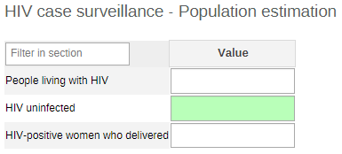

### HIV case surveillance (yearly)

This dataset contains data elements required for annual analysis based on data aggregated from HIV case surveillance service delivery & distribution sites. It includes the following:

- Clients attending HIV case and treatment services by key population category, age and gender
- PLHIV with a multi-monthly drug administration
- PLHIV enrolled and eligible for DSD ART models by age and gender
- PLHIV in DSD ART model tested for viral load and the ones with viral suppression
- Pregnant women on ART delivering at a facility and the ones with a suppressed viral load
- HIV-exposed infant ART prophylaxis status
- HIV-exposed infant HIV and viral load testing
- PLHIV initiating ART screened for TB
- PLHIV initiating ART investigated and diagnosed for TB disease and relative treatment
- PLHIV tested for syphilis and gonorrhoea by key population category
- PLHIV tested for syphilis and gonorrhoea by age and gender
- PLHIV treated for syphilis and gonorrhoea
- PLHIV diagnosed with STI syndromes
- PLHIV tested for viral hepatitis
- PLHIV treated for viral hepatitis and final outcome
- WLHIV screened for cervical precancer lesions and cervical cancer
- WLHIV diagnosed with cervical cancer and relative treatment

### HIV case surveillance (monthly)

This dataset contains data elements for routine monthly analysis based on data aggregated from HIV care and treatment service delivery & distribution sites. It contains the following: 

- New HIV cases by age, gender and key population category 
- ART initiation 
- PLHIV CD4 counting at ART initiation
- PLHIV currently on ART
- PLHIV virologically suppressed
- PLHIV on ART for at least six months
- PLHIV in the cohort by age and gender
- Probable route of transmission of new HIV cases
- ART treatment status by gender
- PLHIV with a multi-monthly drug administration
- PLHIV initiating ARTdiagnosed for TB disease and relative treatment
- PLHIV eligible for TB preventive treatment and initiation by age and gender
- TB preventive treatment administered by type
- PLHIV tested for syphilis and gonorrhoea
- Deaths by AIDS-related causes

## Case Surveillance Data Elements

Aggregate domain data elements that are expected to be populated for dashboard analyses are grouped within the Data Element Group ‘HIV case surveillance (dashboard)’ [c6UHfpFrztd]. The data element group allows for easy identification of which data elements should be targeted for exchanging Tracker data to aggregate data elements using the Data Exchange App. 

Some of the data elements contained in the datasets above are cloned (as distinct DEs with distinct DHIS2 IDs) and included in both the monthly and yearly dataset. These cloned metrics are typically counting the number of unique clients within a month or a year; and cannot be aggregated by month to produce the correct number since we are interested in a cohort of clients, not the number of services provided. For example, the same client can access the service multiple times during the year; if we collect this information on a monthly basis and sum across the annual period, we cannot be sure that we did not count the same client multiple times. In these cases, the DEs are clearly labelled with a post-fix as monthly or yearly, as in the example below: 

- HIV - STI: PLHIV tested for syphilis (monthly)
- HIV - STI: PLHIV tested for syphilis (yearly)
