# HIV Prevention Dashboards & Datasets { #hiv-prevention-dashboards-datasets }

## Prevention Dashboards

Thematic dashboards for monitoring various aspects of HIV prevention programming have been developed based on the core indicators included in WHO’s 2022 [*Consolidated guidelines on person-centred HIV strategic information*](https://www.who.int/publications/i/item/9789240055315). Standard dashboard visualizations developed with WHO’s guidance can be rendered at national or sub-national levels depending on user configuration. Dashboards are served entirely by DHIS2 *indicators* as described in the next section. The following dashboards are available for routine analysis of HIV prevention activities.

### HIV Prevention - 01. HTS: HIV testing services

Test volume, distribution & test positivity

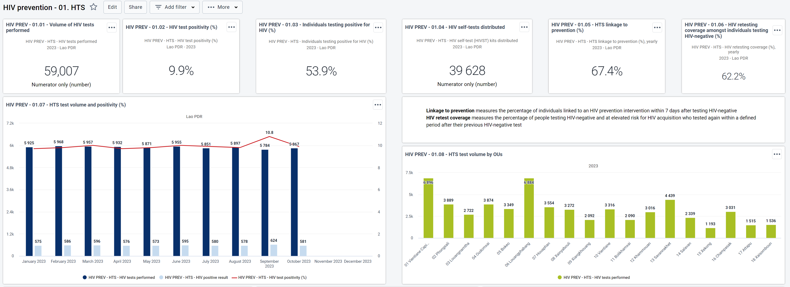

Individuals testing positive by age, gender, key population & geographic distribution

Self testing, partner testing and self-testing kit distirbution

### HIV Prevention - 02. PrEP: Pre-exposure prophylaxis

PrEP recipients & PrEP coverage

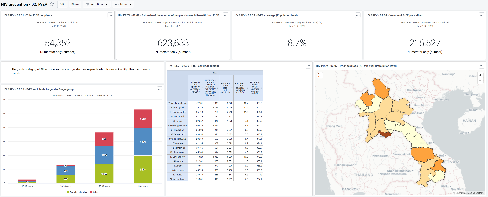

PrEP coverage (program vs population) and PrEP volume

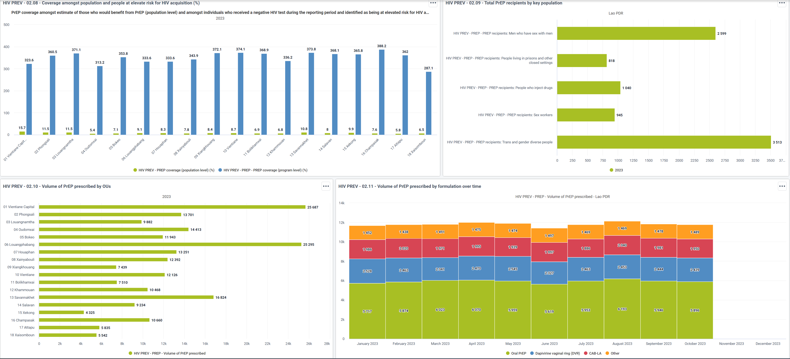

### HIV Prevention - 03. PEP: Post-exposure prophylaxis

PEP recipients by disaggregation and PEP completion

PEP completion and positive tests among PEP recipients

### HIV Prevention - 04. NSP: Needle/Syringe Program

NSP recipients, distribution, and coverage

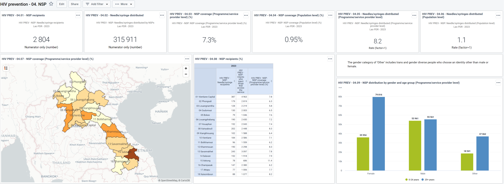

### HIV Prevention - 05. OAMT (Opioid Agonist Maintenance Treatment)

People on OAMT, coverage (program vs population), recipients on treatment for 6 months

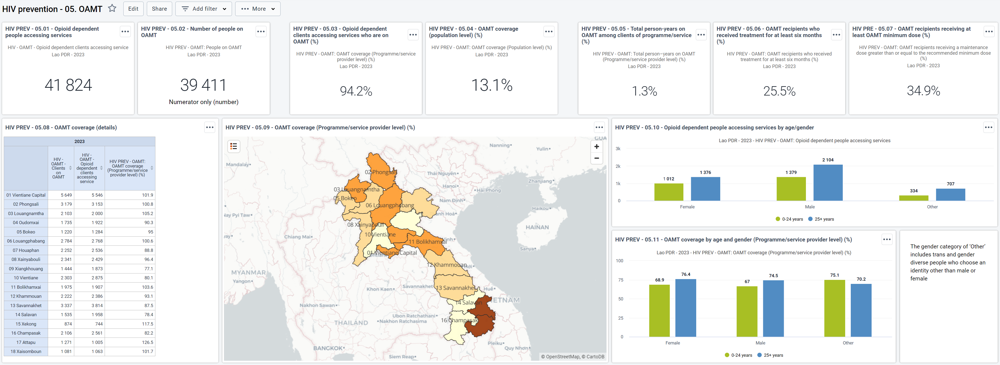

Person years on OAMT, minimum duration & minimum dose

### HIV Prevention - 06. VMMC: voluntary medical male circumcision

Clients undergoing VMMC & VMMC procedures performed

Adverse events reported, by severity and geographic distribution

### HIV Prevention - 07. STI: sexually transmitted infections

Syphilis and gonorrhoea testing, positivity and treatment

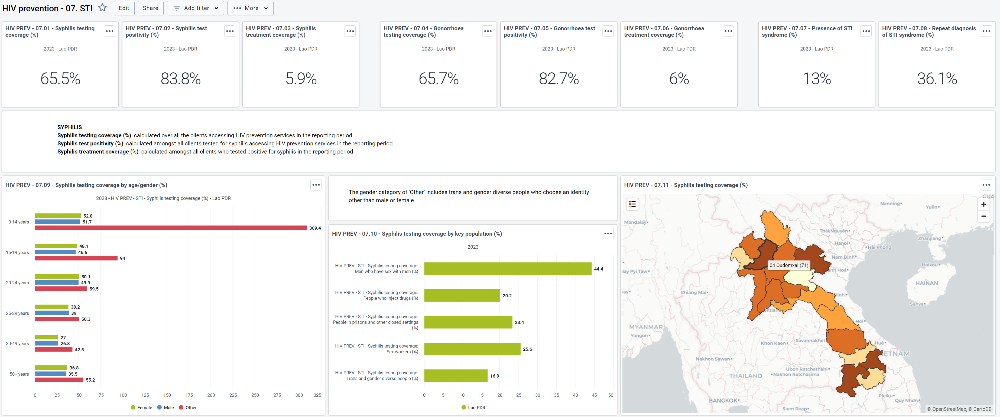

Syphilis testing & positivity, by age & sex

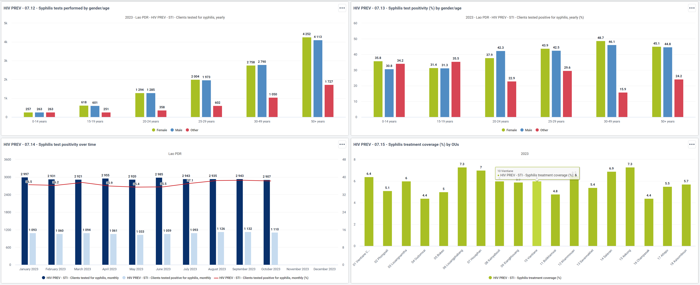

Gonorrhoea testing & positivity, by key population, age & sex

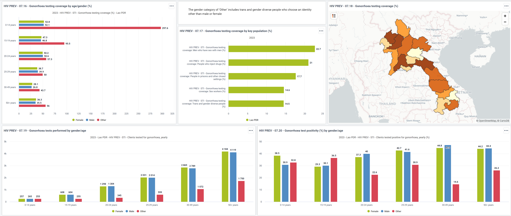

Geographical distribution of STI syndromes and repeat diagnoses over time

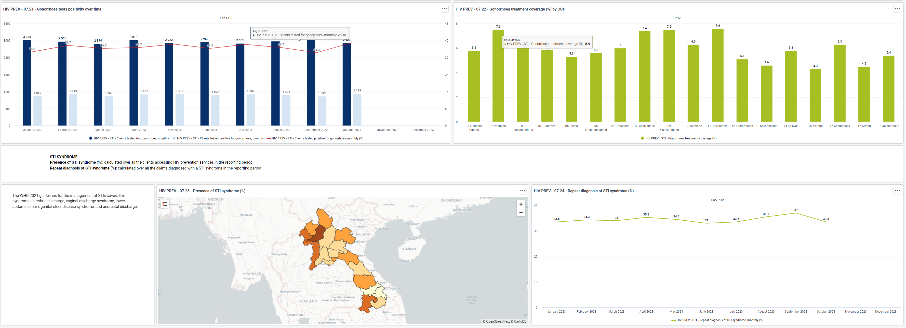

### HIV Prevention - 08. Viral Hepatitis

HBV and HBsAG test coverage and positivity

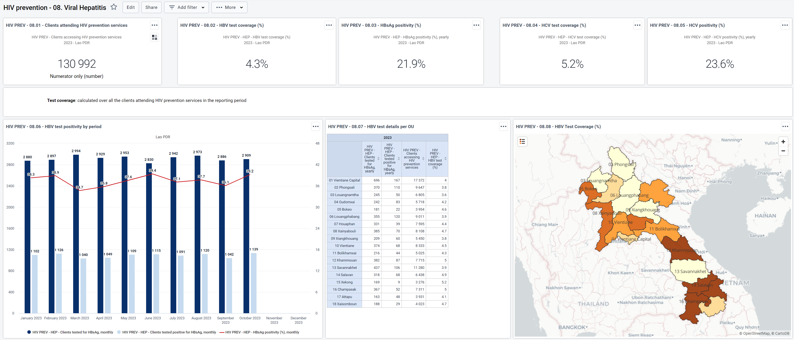

HCV test coverage and posivitiy

### HIV Prevention - 09. Health Facility

Visualizations in this dashboard combine data visualizations from all types of prevention activities. Visualizations are optimized for service delivery site level staff, focusing primarily on numerators or indicators where facility-level denominators are available.

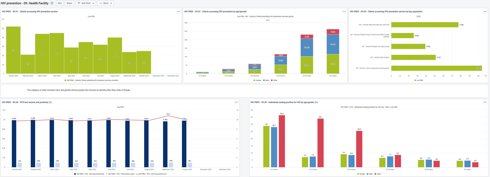

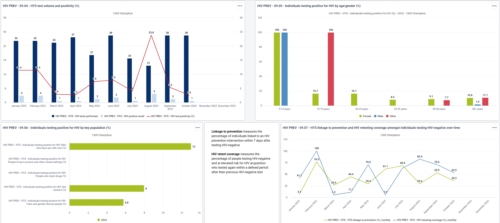

### HIV Prevention - 10. District

Visualizations in this dashboard are optimized for district level programme staff, combining data visualizations from all types of prevention activities. District dashboards allow district staff to compare metrics across service delivery sites.

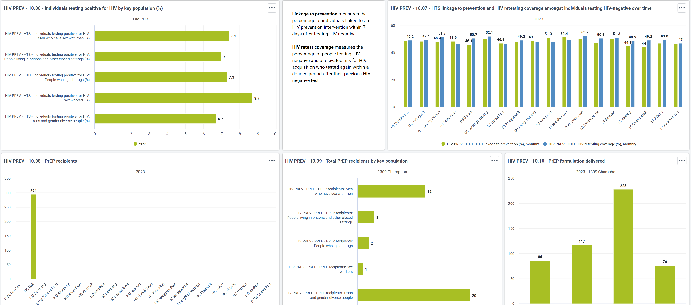

## Prevention Indicators

The toolkit contains DHIS2 indicators which represent the core and optional indicators listed in the WHO’s 2022 [Consolidated guidelines on person-centred HIV strategic information](https://www.who.int/publications/i/item/9789240055315)

All HIV prevention dashboards are served by DHIS2 indicators, which often combine numerators and denominators from individual-level data or other sources. The DHIS2 indicators are mapped and aligned to the indicator definitions and descriptions contained in the WHO’s Digital Adaptation Kit (DAK) for HIV, second edition.

Two indicator groups have been configured to group the indicators as follows:

- HIV prevention - WHO standard list (K6esSqLr8Ta): contains all core and optional WHO SI indicators.
- HIV Prevention - Dashboard (MOrMTBtGQAB): contains all indicators that are used in the standard recommended dashboards; these represent a subset of the WHO standard list

## Prevention Data Sets

As described above, dashboards are populated using the aggregate data model, using DHIS2 indicators. Aggregate datasets, data elements and category combinations have been configured to serve the analytics based on the dimensions of analysis included in the strategic information and data use guidelines. When used in tandem with the DHIS2 Prevention Tracker, values from program indicators are mapped to their corresponding aggregate data element and CatCombo in order to populate the *numerators* and *denominators* for all the indicators included above. These datasets can also be used for aggregated reporting among sites that do not yet have Tracker; or sites that submit routine reports that aggregate data from another individual level data collection tool.

Detailed description of the configuration of program indicators for aggregating tracker data is described in the section **Program Indicators.** Mapping and exchange of Tracker data to Aggregate data model is described in the **section Metadata Mapping & Data Exchange.**

There are three (3) distinct datasets for capturing prevention data. These have been designed based on the analytical needs represented in the WHO’s analysis framework, whereby some metrics may be analyzed on a monthly basis while others are only reported and analyzed annually.

1. HIV Prevention - Population estimates (annual)
2. HIV prevention (yearly)
3. HIV prevention (monthly)

### HIV Prevention - Population estimates

This dataset contains four (4) data elements which are *not* derived from routine reporting; and are typically made available by the HIV programme on an annual basis. These data elements are used for populating denominators for core indicators from the strategic information guidelines. The data set should be assigned to the lowest administrative level for which high-quality estimates exist and can be used for analysis.

These estimates are used for the calculation of the following indicators:

- HIV - PRV.3 PrEP coverage (Population level) (%)
- HIV - PRV.8 NSP coverage (Population level) (%)
- HIV - PRV.9 Regular NSP access (Population level) (%)
- HIV - PRV.10 Needles–syringes distributed (Population level) (ratio)
- HIV - PRV.11 OAMT coverage (Population level) (%) as today
- HIV - PRV.12 Total person–years on OAMT (Population level)
- HIV - INC.1 HIV incidence (/10000 uninfected)

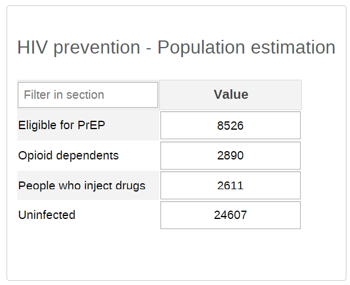

### HIV Prevention (yearly)

This dataset contains data elements required for annual analysis based on data aggregated from HIV prevention service delivery & distribution sites. It includes the following:

- Clients attending HIV prevention services
- Number of clients by key population category
- Testing services & HIV positive tests by key population category
- Clients tested for HIV and testing positive for HIV by age and sex
- PrEP recipients by key population category
- PrEP recipients by age and sex
- Clients prescribed PEP and clients testing HIV positive after receiving prep, disaggregated by key population category
- Clients completing PEP by age band
- Clients prescribed PEP by age and sex
- Needles & syringes distributed and number of recipients by age and sex
- Clients starting, received and maintained on OAMT
- Clients undergoing VMMC by age; clients experiencing adverse events following VMMC
- Clients tested for gonorrhoea and syphilis by age and sex
- Clients tested for viral hepatitis

### HIV Prevention (monthly)

This dataset contains data elements for routine monthly analysis based on data aggregated from HIV prevention service delivery & distribution sites. It contains the following:

- Clients attending HIV prevention services
- HIV testing services (HTS): tests performed, positive test results, self testing kits distributed, clients receiving interventions within 7 days of a negative result
- PrEP: distributed by product type
- PEP: clients prescribed with PEP
- Condoms distributed
- Clients tested for STIs and diagnosed with STIs
- Clients tested for viral hepatitis

### Prevention Data Elements

Aggregate domain data elements that are expected to be populated for dashboard analyses are grouped within the Data Element Group **‘HIV prevention (dashboard)’ [LUxGwKWIpME]**. The data element group allows for easy identification of which data elements should be targeted for exchanging Tracker data to aggregate data elements using the Data Exchange App.

Some of the data elements contained in the datasets above are cloned (as distinct DEs with distinct DHIS2 IDs) and included in both the monthly and yearly dataset. These cloned metrics are typically counting the number of unique clients within a month or a year; and cannot be aggregated by month to produce the correct number since we are interested in a cohort of clients, not the number of services provided. For example, the same client can access the service multiple times during the year; if we collect this information on a monthly basis and sum across the annual period, we cannot be sure that we did not count the same client multiple times. In these cases, the DEs are clearly labeled with a post-fix as monthly or yearly, as in the example below:

- HIV - Volume: Clients attending HIV prevention services (monthly)
- HIV - Volume: Clients attending HIV prevention services (yearly)
